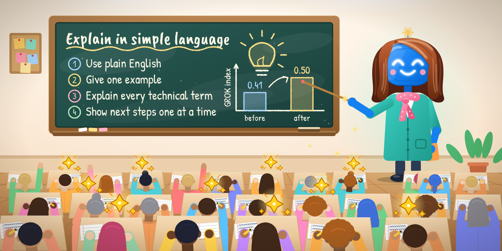

# technical-writing



[](https://github.com/jcatanza/technical-writing/actions/workflows/tests.yml)

A Claude Code skill that makes technical explanations easy to follow on the first read. It follows the writing rules of ASD-STE100 (Simplified Technical English) but does not restrict the vocabulary. It also learns. When the reader flags a passage as confusing and accepts the correction, the skill stores both as a pair of examples. It reads those pairs before the next explanation.

## Install

Claude Code finds skills under `~/.claude/skills/`. The install script links this folder there, so the installed skill tracks the clone:

```sh
git clone https://github.com/jcatanza/technical-writing.git
cd technical-writing && ./install.sh
```

The link stays on your machine, and git never tracks it. The script also builds the examples digest. After installation, `/technical-writing` works in any session. Claude loads the skill on its own when it explains technical material or when the reader says something is unclear.

The skill needs Python 3.9 or later and no other package. The tests also need pytest. They pass on Python 3.9, 3.12 and 3.13.

## Make the loop automatic

Claude loads the skill when it explains technical material or when you flag a passage. To make Claude record every accepted correction, add this line to your `CLAUDE.md`, for example `~/.claude/CLAUDE.md`:

> **Flag, accept, rewrite, drop.** I flag a passage with `explain "xxx"`. Use the `technical-writing` skill: answer with an explanation and replacement wording, and number the passages when I flag several. I write `accept N` to close a passage, `rewrite N: <instructions>` to ask for a revision and `drop N` to abandon it. These four words are commands at the start of a message or line, or in a comma-separated list that opens the message, such as `accept 1, accept 2`. Keep every failed version and my instructions. Record a pair only after `accept`, with my last version as the positive example, and tell me in one line. Change the document only when I say go. Until every passage closes, end each reply with a one-line reminder.

## How it learns

1. The reader flags a passage with `explain "xxx"`.
2. Claude answers with an explanation and replacement wording, using a concrete case.
3. The reader writes `accept`, or `rewrite` with instructions, and Claude revises until the reader writes `accept`. Then Claude runs `scripts/add_example.py`.
4. The script stores the flagged passage as the negative example and the last version before `accept` as the positive one. Each failed version and the reader's instructions for it are kept with the pair.
5. It also stores what was wrong in the reader's words, a one-line lesson, failure tags and the sign of acceptance. It strips venting from the complaint and keeps the core.
6. The script rebuilds `references/examples-digest.md`. Claude reads that digest before it explains anything, so the new pair shapes the next answer.

Four more parts adapt as pairs arrive:

- The digest ranks failure types by how often they occurred, so the skill's emphasis follows the reader's own history.
- The test suite replays every pair. The checker must keep catching what it caught in the negative example, and it must not start flagging the positive one.
- The checker watches for labels of two or more words that confused the reader before.
- The script stores a failed first fix with the pair as `attempt-N.txt`.

Claude proposes a new rule when one failure tag recurs three times. It never adds a rule silently, and the script never commits.

## Where the pairs live

`examples/` holds the shared seed pairs, and git tracks them. `examples-local/` holds the pairs that `add_example.py` records. Git ignores that folder, so the reader's real excerpts stay on the reader's machine. Git also ignores the generated digest. Pass `--public` to store a pair in `examples/`, but only after you check that it holds no private material. The script then scans the pair for email addresses, home folder paths, links and every term in `private-terms.txt`, an optional file that git ignores. It refuses the pair if it finds one.

## The checker

`scripts/plain_check.py draft.md` lists mechanical faults:

- a first sentence that is long or opens with filler;
- abbreviations that the text never expands;
- number ranges with no baseline, and number pairs in brackets;
- code names;
- sentences over 25 words and numbered steps over 20 words, the ASD-STE100 limits;
- paragraphs of more than six sentences;
- passive voice and perfect tenses, as heuristics;
- three or more "If" branches;
- labels coined in the conversation and never defined.

It cannot tell whether a text is clear. The author's history held 97 answers that the reader complained about and 377 that the reader did not, each of at least 60 words. The checker flagged 99% of the first group and 98% of the second, with 3.3 and 4.5 flags per 100 words.

Most flags came from the ASD-STE100 limits. Sentences over 25 words appeared in 74% and 67% of the answers, and passive constructions appeared in 68% and 64%. Those answers broke the rules whether or not the reader complained. A clean report is therefore a floor. Undefined words and abstract openings, the faults the reader flags most, need Claude's judgment and the examples.

## ASD-STE100

`references/ste-rules.md` summarizes the rules that the skill uses and says which ones the checker tests. The skill does not use the ASD-STE100 dictionary of approved words.

## Tests

```sh
pip install -r requirements-dev.txt
python3 -m pytest -q
```

GitHub runs the same tests on every push, on Python 3.9, 3.12 and 3.13. The workflow is `.github/workflows/tests.yml`.

`tests/test_checks.py` covers each check. `tests/test_examples.py` replays every stored pair. `tests/test_add_example.py` covers the learning script. `tests/test_skill_file.py` covers `SKILL.md`. `tests/test_banner.py` covers the banner.

## Layout

- `SKILL.md` holds the instructions that Claude runs.
- `examples/` holds the shared seed pairs. Each folder has `flagged.txt`, `accepted.txt`, `meta.json` and sometimes `attempt-N.txt`.
- `examples-local/` holds the reader's own pairs and never enters git.
- `references/` holds the ASD-STE100 summary and the generated digest.
- `scripts/` holds the checker, the learning script and the digest builder.
- `docs/banner/` holds the banner picture, the scripts that draw it and the two fonts it embeds.
- `install.sh`, `handoff.md` and `tests/` complete the project.

## The banner

`docs/banner/make_banner.py` draws the picture at the top of this page as a Scalable Vector Graphics (SVG) file. `docs/banner/render_png.py` then renders that file to `banner.png` in a browser that runs without a window. It needs Chrome or Chromium on your PATH.

```sh
python3 docs/banner/make_banner.py
python3 docs/banner/render_png.py
```

The same code always draws the same picture. `tests/test_banner.py` fails when the drawing changes and `banner.png` does not. The chart on the blackboard is an illustration. Its "GROK index" and its two bar values have no source, and the skill computes no such measure.

## Origin

The eleven seed pairs adapt real corrections. A reader flagged each passage as confusing while working through a graduate machine-learning course, and the reader accepted the fix. The faults and the fixes are real. The subject matter is new: a greenhouse frost-alert system, a library and a photo app. The corrected texts also follow the ASD-STE100 rules, so they differ from the original wording. The repository therefore holds no course material.

## Privacy

The seed pairs hold no private material. Pairs that you record go to `examples-local/` and stay on your machine. Check a pair before you pass `--public`.

## License

This project uses the MIT license. See `LICENSE`. The two fonts in `docs/banner/fonts/` are under their own license, the SIL Open Font License 1.1. Each font comes with a copy of that license.

## Credit

Joseph Catanzarite wrote this project with Claude Sonnet 5.5 (max reasoning effort, thinking enabled) as research partner.
